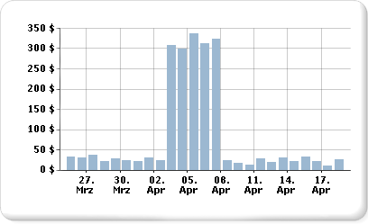

# Anzeigen einer Reihe mit mehreren Datenbereichen in einem Diagramm (Berichts-Generator und SSRS)
  Ein Diagramm verwendet die niedrigsten und die höchsten Werte einer Reihe, um die Achsenskalierung zu berechnen. Wenn eine Reihe im Diagramm mehr als einen Datenbereich enthält, sind ggf. nicht mehr alle Datenpunkte sichtbar, und es werden nur einige Datenpunkte im Diagramm deutlich angezeigt. Angenommen, ein Bericht zeigt die täglichen Umsatzgesamtbeträge für einen Zeitraum von 30 Tagen an.  
  
   
  
 Der Umsatz liegt für den Monat meist zwischen den Werten 10 und 40. Eine einwöchige Marketingkampagne hat Anfang April jedoch einen abrupten Umsatzanstieg bewirkt. Diese Änderung der Umsatzdaten führt zu einer ungleichmäßigen Verteilung von Datenpunkten, sodass die Lesbarkeit des gesamten Diagramms verringert wird.  
  
 Es gibt verschiedene Möglichkeiten, die Lesbarkeit zu verbessern.  
  
-   **Skalierungsunterbrechungen aktivieren**: Wenn die Daten zwei oder mehr Gruppen von Datenbereichen bilden, können Sie die Lücke zwischen den Bereichen mit einer Skalierungsunterbrechung entfernen. Eine Skalierungsunterbrechung ist ein Streifen, der über den Zeichnungsbereich gezogen wird, um eine Unterbrechung zwischen den hohen und niedrigen Werten einer Reihe zu kennzeichnen.  
  
-   **Filter für unnötige Werte**: Wenn Datenpunkte vorhanden sind, die den wichtigen Datenbereich eines Diagramms verdecken, können Sie die nicht erwünschten Punkte mit einem Berichtsfilter entfernen. Weitere Informationen zum Hinzufügen eines Filters zum Diagramm in [!INCLUDE[ssRSnoversion](../../includes/ssrsnoversion-md.md)] finden Sie unter [Hinzufügen von Datasetfiltern, Datenbereichsfiltern, und Gruppenfiltern &#40; Berichts-Generator und SSRS &#41;](../../reporting-services/report-design/add dataset filters, data region filters, and group filters.md).  
  
-   **Plotten jedes Datenbereichs als separate Reihe, um mehrere Reihen vergleichen zu können**: Wenn Sie über mehr als zwei Datenbereiche verfügen, sollten Sie erwägen, die Datenbereiche in separate Reihen zu unterteilen. Weitere Informationen hierzu finden Sie unter [Mehrere Reihen in einem Diagramm &#40;Berichts-Generator und SSRS&#41;](../../reporting-services/report-design/multiple-series-on-a-chart-report-builder-and-ssrs.md).  
  
> [!NOTE]  
>  [!INCLUDE[ssRBRDDup](../../includes/ssrbrddup-md.md)]  
  
## Anzeigen von mehreren Datenbereichen mit Skalierungsunterbrechungen  
 Wenn Sie eine Skalierungsunterbrechung aktivieren, berechnet das Diagramm, an welcher Stelle im Diagramm eine Linie gezeichnet werden soll. Zwischen den Bereichen muss eine ausreichende Trennung bestehen, damit eine Skalierungsunterbrechung gezeichnet werden kann. Standardmäßig kann eine Skalierungsunterbrechung nur hinzugefügt werden, wenn eine Trennung zwischen den Datenbereichen eines Diagramms mindestens 25 % ausmacht.  
  
   
  
> [!NOTE]  
>  Sie können nicht angeben, an welcher Stelle im Diagramm eine Skalierungsunterbrechung platziert werden soll. Sie können jedoch ändern, wie die Skalierungsunterbrechung berechnet wird. Dies wird weiter unten in diesem Thema beschrieben.  
  
 Wenn Sie eine Skalierungsunterbrechung aktivieren, diese jedoch auch dann nicht angezeigt wird, wenn zwischen den Datenbereichen ein ausreichender Abstand herrscht, können Sie die Eigenschaft CollapsibleSpaceThreshold auf einen niedrigeren Wert als 25 festlegen. CollapsibleSpaceThreshold gibt den erforderlichen reduzierbaren Zwischenraum an, der zwischen den Datenbereichen vorhanden sein muss. Weitere Informationen hierzu finden Sie unter [Hinzufügen von Skalierungsunterbrechungen zu einem Diagramm &#40;Berichts-Generator und SSRS&#41;](../../reporting-services/report-design/add-scale-breaks-to-a-chart-report-builder-and-ssrs.md).  
  
 Diagramme unterstützen bis zu fünf Skalierungsunterbrechungen pro Diagramm. Ein Diagramm wird jedoch ggf. unleserlich, wenn mehr als eine Skalierungsunterbrechung angezeigt wird. Wenn Sie mehr als zwei Datenbereiche haben, sollten Sie erwägen, zum Anzeigen der Daten eine andere Methode zu verwenden. Weitere Informationen hierzu finden Sie unter [Mehrere Reihen in einem Diagramm &#40;Berichts-Generator und SSRS&#41;](../../reporting-services/report-design/multiple-series-on-a-chart-report-builder-and-ssrs.md).  
  
## Nicht unterstützte Skalierungsunterbrechungsszenarios  
 Skalierungsunterbrechungen werden für die folgenden Diagrammszenarios nicht unterstützt:  
  
-   Das Diagramm weist eine 3D-Aktivierung auf.  
  
-   Eine logarithmische Wertachse wurde angegeben.  
  
-   Für die Wertachse wurden der Mindestwert und der Höchstwert explizit festgelegt.  
  
-   Das Diagramm hat den folgenden Typ: Polar, Netz, Kreis, Ring, Trichter, Pyramide oder Gestapelt.  
  
 Ein Beispiel eines Diagramms mit Skalierungsunterbrechungen ist als Beispielbericht verfügbar. Weitere Informationen zum Herunterladen des Beispielberichts und anderer Berichte finden Sie unter [!INCLUDE[ssCurrent](../../includes/sscurrent-md.md)][Beispielberichte zu Berichts-Generator und Berichts-Designer](http://go.microsoft.com/fwlink/?LinkId=198283).  
  
## Siehe auch  
 [Mehrere Reihen in einem Diagramm &#40;Berichts-Generator und SSRS&#41;](../../reporting-services/report-design/multiple-series-on-a-chart-report-builder-and-ssrs.md)   
 [Formatieren eines Diagramms &#40;Berichts-Generator und SSRS&#41;](../../reporting-services/report-design/formatting-a-chart-report-builder-and-ssrs.md)   
 [3D, Abschrägungen und andere Effekte in einem Diagramm &#40;Berichts-Generator und SSRS&#41;](../../reporting-services/report-design/3d-bevel-and-other-effects-in-a-chart-report-builder-and-ssrs.md)   
 [Diagramme &#40;Berichts-Generator und SSRS&#41;](../../reporting-services/report-design/charts-report-builder-and-ssrs.md)   
 [Achseneigenschaften (Dialogfeld), Achsenoptionen &#40;Berichts-Generator und SSRS&#41;](../Topic/Axis%20Properties%20Dialog%20Box,%20Axis%20Options%20\(Report%20Builder%20and%20SSRS\).md)   
 [Zusammenfassen von kleinen Slices in einem Kreisdiagramm &#40;Berichts-Generator und SSRS&#41;](../../reporting-services/report-design/collect-small-slices-on-a-pie-chart-report-builder-and-ssrs.md)  
  
  