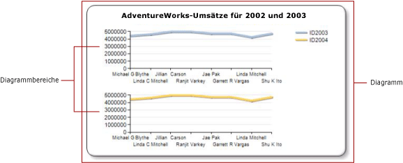

# Angeben einer Diagrammfläche für eine Reihe (Berichts-Generator und SSRS)
  in paginierten [!INCLUDE[ssRSnoversion_md](../../includes/ssrsnoversion-md.md)] -Berichten stellt das *Diagramm* den Container der obersten Ebene dar, der den äußeren Rahmen, den Diagrammtitel und die Legende enthält. Standardmäßig wird im Diagramm eine *Diagrammfläche*angezeigt. Die Diagrammfläche ist auf der Diagrammoberfläche nicht sichtbar. Sie können sich diese jedoch als Container vorstellen, der lediglich die Achsenbezeichnungen, den Achsentitel und den Zeichnungsbereich einer oder mehrerer Reihen umfasst. In der folgenden Abbildung wird das Konzept mehrerer Diagrammflächen in einem einzelnen Diagramm veranschaulicht.  
  
   
  
 Standardmäßig werden alle Reihen der Standarddiagrammfläche hinzugefügt. In Flächen-, Säulen-, Linien- und Punktdiagrammen kann in einer Diagrammfläche eine beliebige Kombination dieser Reihen angezeigt werden. Bei mehreren Reihen in einer einzelnen Diagrammfläche verschlechtert sich die Lesbarkeit des Diagramms. Sie können die Diagrammtypen in mehrere Diagrammflächen aufteilen. Bei mehreren Diagrammflächen verbessert sich Lesbarkeit, sodass Vergleiche erleichtert werden. Zum Beispiel weisen Preis-Volumen-Kursdiagramme häufig unterschiedliche Wertebereiche auf, dennoch können Vergleiche zwischen Preis- und Volumendaten in demselben Zeitraum vorgenommen werden.  
  
 Die Balken-, Polar- oder Formreihen können nur mit Reihen derselben Diagrammtypen in derselben Diagrammfläche kombiniert werden. Wenn Sie ein Polar- oder Formdiagramm verwenden, erwägen Sie, für jedes anzuzeigende Feld einen eigenen Diagrammdatenbereich zu verwenden.  
  
> [!NOTE]  
>  [!INCLUDE[ssRBRDDup](../../includes/ssrbrddup-md.md)]  
  
## So ordnen Sie eine Reihe einer neuen Diagrammfläche zu  
  
1.  Klicken Sie mit der rechten Maustaste auf eine beliebige Stelle im Diagramm, und wählen Sie **Neue Diagrammfläche hinzufügen**aus. Im Diagramm wird eine neue, leere Diagrammfläche angezeigt.  
  
2.  Klicken Sie mit der rechten Maustaste auf die Reihe im Diagramm oder auf eine Reihe oder ein Datenfeld in der entsprechenden Fläche im Bereich „Diagrammdaten“, und klicken Sie dann auf **Reiheneigenschaften**.  
  
3.  Wählen Sie unter **Achsen und Diagrammfläche**die Diagrammfläche aus, in der die Reihe angezeigt werden soll.  
  
4.  (Optional) Richten Sie die Diagrammflächen vertikal aus. Klicken Sie dazu mit der rechten Maustaste auf das Diagramm, und wählen Sie **Diagrammflächeneigenschaften**aus. Wählen Sie unter **Ausrichtung**eine andere Diagrammfläche aus, an der Sie die ausgewählte Diagrammfläche ausrichten möchten.  
  
## Siehe auch  
 [Mehrere Reihen in einem Diagramm &#40; Berichts-Generator und SSRS &#41;](../../reporting-services/report-design/multiple-series-on-a-chart-report-builder-and-ssrs.md)   
 [Formatieren von Datenpunkten in einem Diagramm &#40; Berichts-Generator und SSRS &#41;](../../reporting-services/report-design/formatting-data-points-on-a-chart-report-builder-and-ssrs.md)   
 [Definieren von Farben in einem Diagramm mit einer Palette &#40; Berichts-Generator und SSRS &#41;](../../reporting-services/report-design/define-colors-on-a-chart-using-a-palette-report-builder-and-ssrs.md)   
 [Polardiagramme &#40; Berichts-Generator und SSRS &#41;](../../reporting-services/report-design/polar-charts-report-builder-and-ssrs.md)   
 [Formdiagramme &#40; Berichts-Generator und SSRS &#41;](../../reporting-services/report-design/shape-charts-report-builder-and-ssrs.md)   
 [Kreisdiagramme &#40; Berichts-Generator und SSRS &#41;](../../reporting-services/report-design/pie-charts-report-builder-and-ssrs.md)  
  
  

