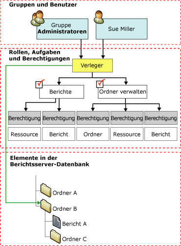

# Rollenzuweisungen
  In [!INCLUDE[ssRSnoversion](../../includes/ssrsnoversion-md.md)]bestimmen *Rollenzuweisungen* den Zugriff auf gespeicherte Elemente und auf den Berichtsserver selbst. Eine Rollenzuweisung besteht aus den folgenden Teilen:  
  
-   Einem sicherungsfähigen Element, für das Sie den Zugriff steuern möchten. Beispiele für sicherungsfähige Elemente sind Ordner, Berichte und Ressourcen.  
  
-   Einem Benutzer- oder Gruppenkonto, das mit der Windows-Sicherheit oder einem sonstigen Authentifizierungsmechanismus authentifiziert werden kann.  
  
-   Rollendefinitionen, die eine Gruppe von Aufgaben definieren. Beispiele für Rollendefinitionen sind **System-Administrator**, **Inhalts-Manager**und **Verleger**.  
  
 Rollenzuweisungen werden innerhalb der Ordnerhierarchie vererbt. Die für einen Ordner definierte Rollenzuweisung wird automatisch an alle Berichte, freigegebenen Datenquellen, Ressourcen und Unterordner, die dieser Ordner enthält, vererbt. Sie können die geerbte Sicherheit überschreiben, indem Sie Rollenzuweisungen für einzelne Elemente definieren. Alle Teile der Ordnerhierarchie müssen durch mindestens eine Rollenzuweisung gesichert werden. Es ist nicht möglich, ein nicht gesichertes Element zu erstellen oder Einstellungen derart zu ändern, dass dadurch ein nicht gesichertes Element entsteht.  
  
 Das folgende Diagramm veranschaulicht eine Rollenzuweisung, die einer Gruppe und einem bestimmten Benutzer die **Verleger** -Rolle für den Ordner B zuordnet.  
  
   
Rollenzuweisungsdiagramm  
  
## Rollenzuweisungen auf System- und Elementebene  
 Die rollenbasierte Sicherheit in [!INCLUDE[ssRSnoversion](../../includes/ssrsnoversion-md.md)] wird anhand der folgenden Ebenen organisiert:  
  
-   Rollenzuweisungen auf Elementebene steuern den Zugriff auf Berichte, Ordner, Berichtsmodelle, freigegebene Datenquellen und Ressourcen in der Ordnerhierarchie des Berichtsservers. Rollenzuweisungen auf Elementebene werden definiert, wenn eine Rollenzuweisung für ein bestimmtes Element oder den Stammordner erstellt wird.  
  
-   Systemrollenzuweisungen berechtigen zu Vorgängen, die sich auf den gesamten Server beziehen (so ist z. B. die Fähigkeit, Aufträge zu verwalten, ein Vorgang auf Systemebene). Eine Systemrollenzuweisung entspricht nicht einem Systemadministrator. Mit der Rollenzuweisung werden keine erweiterten Berechtigungen übertragen, die die vollständige Steuerung eines Berichtsservers ermöglichen.  
  
 Eine Systemrollenzuweisung gewährt nicht den Zugriff auf Elemente in der Ordnerhierarchie. System- und Elementsicherheit schließen sich gegenseitig aus. Für bestimmte Benutzer oder Gruppen kann es notwendig sein, Rollenzuweisungen sowohl auf System- als auch auf Elementebene zu erstellen, um den Zugriff auf einen Berichtsserver in ausreichendem Maße zu ermöglichen.  
  
## Benutzer und Gruppen in Rollenzuweisungen  
 Bei den Benutzer- oder Gruppenkonten, die Sie in Rollenzuweisungen angeben, handelt es sich um Domänenkonten. Der Berichtsserver erstellt oder verwaltet zwar keine Benutzer und Gruppen aus einer [!INCLUDE[msCoName](../../includes/msconame-md.md)] Windows-Domäne (oder einem anderen Sicherheitsmodell, falls Sie eine benutzerdefinierte Sicherheitserweiterung verwenden), aber er verweist auf diese.  
  
 Rollenzuweisungen für ein bestimmtes Element dürfen nicht für dasselbe Benutzer- oder Gruppenkonto angegeben werden. Falls ein Benutzerkonto auch Mitglied eines Gruppenkontos ist und für beide Rollenzuweisungen vorhanden sind, stehen die Aufgaben der beiden Rollenzuweisungen dem Benutzer zur Verfügung.  
  
 Wenn Sie einer Gruppe, die bereits Teil einer Rollenzuweisung ist, einen Benutzer hinzufügen, müssen Sie IIS zurücksetzen, damit die neue Rollenzuweisung für diesen Benutzer wirksam wird.  
  
## Vordefinierte Rollenzuweisungen  
 Standardmäßig werden vordefinierte Rollenzuweisungen implementiert, die lokalen Administratoren die Verwaltung des Berichtsservers ermöglichen. Sie müssen weitere Rollenzuweisungen hinzufügen, um anderen Benutzern den Zugriff zu gewähren.  
  
 Weitere Informationen zu den vordefinierten Rollenzuweisungen, die Standardsicherheit bereitstellen, finden Sie unter [Vordefinierte Rollen](../../reporting-services/security/role-definitions-predefined-roles.md).  
  
## Siehe auch  
 [Erstellen Sie, löschen Sie oder ändern Sie einer Rolle &#40; Management Studio &#41;](../../reporting-services/security/role-definitions-create-delete-or-modify.md)   
 [Gewähren von Benutzerzugriff auf einen Berichtsserver &#40; Berichts-Manager &#41;](../../reporting-services/security/grant-user-access-to-a-report-server-report-manager.md)   
 [Ändern Sie oder löschen Sie einer Rollenzuweisung &#40; Berichts-Manager &#41;](../../reporting-services/security/role-assignments-modify-or-delete.md)   
 [Festlegen von Berechtigungen für Berichtsserverelemente auf einer SharePoint-Website &#40; Reporting Services in SharePoint integrierten Modus &#41;](../../reporting-services/security/set-permissions-for-report-server-items-on-a-sharepoint-site.md)   
 [Erteilen von Berechtigungen für einen Berichtsserver im einheitlichen Modus](../../reporting-services/security/granting-permissions-on-a-native-mode-report-server.md)  
  
  
