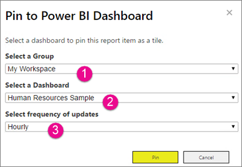
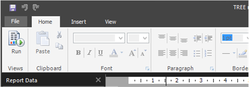

# <a name="whats-new-in-sql-server-reporting-services-ssrs"></a>Was ist neu in SQL Server Reporting Services (SSRS)

[!INCLUDE[ssrs-appliesto](../includes/ssrs-appliesto.md)] [!INCLUDE[ssrs-appliesto-2016-and-later](../includes/ssrs-appliesto-2016-and-later.md)] [!INCLUDE[ssrs-appliesto-not-pbirsi](../includes/ssrs-appliesto-not-pbirs.md)]

Erfahren Sie mehr über die Neuigkeiten in SQL Server [!INCLUDE[ssRSnoversion](../includes/ssrsnoversion-md.md)]. Dadurch werden die wichtigsten Funktionsbereiche behandelt und wird aktualisiert, sobald neue Elemente freigegeben werden.

  Informationen zu in anderen Bereichen von SQL Server Neuigkeiten finden Sie unter [Neuigkeiten in SQL Server-2017](../sql-server/what-s-new-in-sql-server-2017.md) oder [Neuigkeiten in SQL Server 2016](../sql-server/what-s-new-in-sql-server-2016.md).

 **Herunterladen** 

- Um Reporting Services in SQL Server 2017 herunterzuladen, wechseln Sie zu der  **[Microsoft Download Center](https://www.microsoft.com/download/details.aspx?id=55252)**.

Die aktuellen versionsanmerkungen finden Sie unter [Versionsanmerkungen zu SQL Server 2017](../sql-server/sql-server-2017-release-notes.md) oder [Power BI-Berichtsserver-Versionshinweise](https://powerbi.microsoft.com/documentation/reportserver-release-notes/). Weitere Informationen zu Power BI-Berichtsserver, finden Sie unter [erste Schritte mit Power BI-Berichtsserver](https://powerbi.microsoft.com/documentation/reportserver-get-started/).

## <a name="whats-new-in-sql-server-2017"></a>Neuigkeiten in SQL Server-2017

### <a name="comments-on-reports"></a>Kommentare in Berichten

Kommentare sind jetzt für Berichte, Perspektive hinzufügen und Zusammenarbeit mit anderen Benutzern zur Verfügung. Sie können auch die Anlagen mit Kommentaren einschließen.


Weitere Informationen finden Sie unter [Hinzufügen von Kommentaren zu einem Bericht auf einem Berichtsserver](https://powerbi.microsoft.com/documentation/reportserver-add-comments/).

### <a name="dax-queries-in-reporting-tools"></a>DAX-Abfragen in Berichtstools

In den neuesten Versionen von Berichts-Generator und SQL Server Data Tools können Sie systemeigene DAX-Abfragen für unterstützte SQL Server Analysis Services-tabellendatenmodellen per Drag & Drop die gewünschten Felder in der Abfrage-Designer erstellen. Finden Sie unter der [Reporting Services-Blog](https://blogs.msdn.microsoft.com/sqlrsteamblog/2017/03/09/query-designer-support-for-dax-now-available-in-report-builder-and-sql-server-data-tools/).

### <a name="rest-api-support"></a>REST-API-Unterstützung

Um die Entwicklung von modernen Anwendungen und Anpassung zu ermöglichen, unterstützt SQL Server Reporting Services jetzt eine vollständig OpenAPI kompatibel RESTful-API. Die vollständige API-Spezifikation und Dokumentation jetzt befinden sich auf [Swaggerhub](https://app.swaggerhub.com/apis/microsoft-rs/SSRS/2.0).

## <a name="query-designer-support-for-dax-now-in-report-builder-and-sql-server-data-tools"></a>Abfrage-Designer-Unterstützung für DAX jetzt im Berichts-Generator und SQL Server Data Tools

In den neuesten Versionen von Berichts-Generator und SQL Server Data Tools – Release Candidate (RC) können Sie nun die systemeigene DAX-Abfragen für unterstützte SQL Server Analysis Services-tabellendatenmodellen erstellen. Sie können den Abfrage-Designer beide Tools verwenden, um Drag & drop die Felder werden soll und die DAX-Abfrage, die für Sie generiert werden, statt sie selbst geschrieben haben.  
 
Erfahren Sie mehr auf die [Reporting Services-Blog](https://blogs.msdn.microsoft.com/sqlrsteamblog/2017/03/09/query-designer-support-for-dax-now-available-in-report-builder-and-sql-server-data-tools/).

* Herunterladen [SQL Server 2016 Berichts-Generator](https://go.microsoft.com/fwlink/?LinkId=734968).
* Herunterladen [SQL Server Datatools - Release Candidate](https://docs.microsoft.com/sql/ssdt/sql-server-data-tools-ssdt-release-candidate).

> **Hinweis**: Sie können den Abfrage-Designer nur für DAX verwenden, mit SSAS tabular Datenquellen integriert in SQL Server 2016 oder höher.
 
## <a name="whats-new-in-sql-server-2016"></a>Neuigkeiten in SQL Server 2016
  
### <a name="reporting-services-includessrswebportal-non-markdownincludesssrswebportal-non-markdown-mdmd"></a>Reporting Services[!INCLUDE[ssRSWebPortal-Non-Markdown](../includes/ssrswebportal-non-markdown-md.md)]  
 Ein neues [!INCLUDE[ssRSnoversion](../includes/ssrsnoversion-md.md)] [!INCLUDE[ssRSWebPortal-Non-Markdown](../includes/ssrswebportal-non-markdown-md.md)] verfügbar ist. Dies ist ein aktualisiertes und modernes Portal, das KPIs, mobilen Berichte, paginierte Berichte, Excel und Power BI Desktop-Dateien enthält. Die [!INCLUDE[ssRSWebPortal](../includes/ssrswebportal.md)] Berichts-Manager aus früheren Versionen ersetzt. Sie können auch herunterladen Mobile Report Publisher und Berichts-Generator über die [!INCLUDE[ssRSWebPortal](../includes/ssrswebportal.md)] ohne die Notwendigkeit von ClickOnce-Technologie.
 
 Um Mobile Berichte zu erstellen, müssen Sie die [!INCLUDE[SS_MobileReptPub_Short](../includes/ss-mobilereptpub-short-md.md)].  
  
 Weitere Informationen zu den [!INCLUDE[ssRSWebPortal-Non-Markdown](../includes/ssrswebportal-non-markdown-md.md)], finden Sie unter [-Webportal (einheitlicher SSRS-Modus)](../reporting-services/web-portal-ssrs-native-mode.md).  
  
   
 
 #### <a name="custom-branding-for-the-includessrswebportal-non-markdownincludesssrswebportal-non-markdown-mdmd"></a>Benutzerdefiniertes branding für die[!INCLUDE[ssRSWebPortal-Non-Markdown](../includes/ssrswebportal-non-markdown-md.md)] 
  Sie können anpassen, die [!INCLUDE[ssRSWebPortal-Non-Markdown](../includes/ssrswebportal-non-markdown-md.md)] mit Logo und den Farben mithilfe eines Brandingpakets Ihrer Organisation.  
  
  Weitere Informationen zu benutzerdefiniertem branding, finden Sie unter [Branding des Webportals](http://msdn.microsoft.com/en-us/6dac97f7-02a6-4711-81a3-e850a6b40bf1)
 
 #### <a name="key-performance-indicators-kpi-in-the-includessrswebportal-non-markdownincludesssrswebportal-non-markdown-mdmd"></a>Key Performance Indicators (KPI) in der[!INCLUDE[ssRSWebPortal-Non-Markdown](../includes/ssrswebportal-non-markdown-md.md)] 

Können Sie KPIs in direkt erstellen die [!INCLUDE[ssRSWebPortal-Non-Markdown](../includes/ssrswebportal-non-markdown-md.md)] , zu dem Ordner, Sie befinden sich im, Kontextmenü sind. Beim Erstellen von KPIs können Datasetfelder auswählen und diese Werte zusammengefasst. Sie können auch den zugehörigen Inhalt an Drillthrough zu weiteren Details auswählen.
  
 
 
 Weitere Informationen finden Sie unter [arbeiten mit KPIs im Webportal](http://msdn.microsoft.com/en-us/a28cf500-6d47-4268-a248-04837e7a09eb)
  
 
 ### <a name="mobile-reports"></a>Mobile Berichte
 
Reporting Services mobile Berichte sind dedizierte Berichte, die für eine Vielzahl von Formfaktoren optimiert und bieten eine optimale Erfahrung für Benutzer, die Zugriff auf Berichte auf mobilen Geräten. Mobile Berichte an eine Sammlung von Visualisierungen, aus der Zeit, Kategorie und Vergleich Diagramme, benutzerdefinierte Karten zu Treemaps Funktionen. Verbinden Sie mobile Berichte mit einer Bandbreite von Datenquellen, einschließlich der lokalen SQL Server Analysis Services mehrdimensionale und tabellarische Daten. Gestalten Sie Ihre mobile Berichte auf einer Entwurfsoberfläche Rasterzeilen und Spalten und flexible mobiler Berichtselemente, die skaliert werden auch so jeder Bildschirmgröße anpassen. Speichern Sie diese mobilen Berichte an einen Reporting Services-Server, und klicken Sie auf Ansicht und in einem Browser oder in der mobilen Power BI-app auf iPads, iPhones, Android-Telefone und Windows 10-Geräten mit ihnen interagieren.
  
#### <a name="mobile-report-publisher"></a>Publisher für Mobile Berichte  
 Die [!INCLUDE[SS_MobileReptPub_Long](../includes/ss-mobilereptpub-long-md.md)]können Sie zum Erstellen und Veröffentlichen von SQL Server mobile-Berichte auf Ihrem [!INCLUDE[ssRSnoversion](../includes/ssrsnoversion-md.md)] [!INCLUDE[ssRSWebPortal-Non-Markdown](../includes/ssrswebportal-non-markdown-md.md)].  
  
   
  
 Weitere Informationen finden Sie unter [mobile Berichte mit SQL Server Mobile Report Publisher erstellen](../reporting-services/mobile-reports/create-mobile-reports-with-sql-server-mobile-report-publisher.md).  
  
#### <a name="sql-server-mobile-reports-hosted-in-reporting-services-available-in-power-bi-mobile-app"></a>In Reporting Services in Power BI Mobile-app verfügbar gehostete mobile SQL Server-Berichte  
 Die Mobile Power BI-app für iOS für iPad und iPhone kann jetzt auf dem lokalen Berichtsserver gehostete mobile SQL Server-Berichte anzeigen.  
  
   
  
 Sie können nicht ohne einige Änderungen an der Konfiguration standardmäßig eine Verbindung herstellen. Weitere Informationen zum Zulassen der mobilen Power BI-app für die Verbindung mit dem Berichtsserver finden Sie unter [Aktivieren eines Berichtsservers für Power BI Mobile Access](../reporting-services/report-server/enable-a-report-server-for-power-bi-mobile-access.md).
  
### <a name="support-of-sharepoint-mode-and-sharepoint-2016"></a>Unterstützung von SharePoint-Modus und SharePoint 2016  
 [!INCLUDE[ssSQL15](../includes/sssql15-md.md)][!INCLUDE[ssRSnoversion](../includes/ssrsnoversion-md.md)] unterstützt die Integration mit SharePoint 2013 und SharePoint 2016.
 
Weitere Informationen finden Sie unter:  
  
-   [Unterstützte Kombinationen von SharePoint und Reporting Services-Server und-Add-in &#40; SQL Server 2016 &#41;](../reporting-services/install-windows/supported-combinations-of-sharepoint-and-reporting-services-server.md)  
  
-   [Wo der Reporting Services-add-in für SharePoint-Produkte zu finden.](../reporting-services/install-windows/where-to-find-the-reporting-services-add-in-for-sharepoint-products.md)  
  
-   [Installieren Sie SharePoint-Modus von Reporting Services](../reporting-services/install-windows/install-reporting-services-sharepoint-mode.md)  

### <a name="microsoft-net-framework-4-support"></a>Microsoft .NET Framework 4-Unterstützung  
 [!INCLUDE[ssRSCurrent](../includes/ssrscurrent-md.md)]unterstützt die aktuellen Versionen von Microsoft .NET Framework 4. Dies umfasst die Versionen 4.0 und 4.5.1. Wenn keine Version von .net Framework 4.x installiert ist, [!INCLUDE[ssNoVersion](../includes/ssnoversion-md.md)] Setup installiert .NET 4.0 während des funktionsinstallationsschritts.  

### <a name="report-improvements"></a>Bericht-Verbesserungen

**HTML 5-Renderingmodul:** eines neuen HTML5-Renderingmodul, das "full" Standardmodus modernen Webanwendungen und moderne Browser ausgerichtet ist.  Das neue Renderingmodul beruht nicht mehr auf dem Quirksmodus, die von einigen älteren Browsern verwendet.
  
 Weitere Informationen zu Browserunterstützung finden Sie unter [Browserunterstützung für Reporting Services und Power View](../reporting-services/browser-support-for-reporting-services-and-power-view.md).  

**Moderne paginierte Berichte:** moderne paginierte Berichte mit neuen, modernen Formatvorlagen für Diagramme, Messgeräte, Karten und andere datenvisualisierungen zu entwerfen.
  
**TreeMap-und Sunburst-Diagramme:** verbessern Sie Ihre Berichte mit der Strukturzuordnung  und Sunburst  Diagrammen, hervorragenden Möglichkeiten, um hierarchische Daten anzuzeigen. Weitere Informationen finden Sie unter [TreeMap- und Sunburst-Diagramme in Reporting Services](../reporting-services/report-design/tree-map-and-sunburst-charts-in-reporting-services.md).  

**Berichtseinbettung:** Sie können jetzt mobile und paginierte Berichte in andere Webseiten und Anwendungen einbetten, mithilfe eines IFRAMEs zusammen mit URL-Parameter.  

**Anheften von Berichtselementen an ein Power BI-Dashboard:** beim Anzeigen eines Berichts in der [!INCLUDE[ssRSWebPortal](../includes/ssrswebportal.md)], können Sie Berichtselemente auswählen und Heften Sie sie auf eine [!INCLUDE[sspowerbi](../includes/sspowerbi-md.md)] Dashboard.   Die Elemente, die angeheftet werden können, sind Diagramme, messgerätbereiche, Karten und Bilder. Sie können **(1)** wählen Sie die Gruppe, die das Dashboard enthält, smbstoragetier1 **(2)** wählen Sie das Dashboard, das Sie das Element anheften möchten und **(3)** auswählen, wie häufig werden soll die Kachel im Dashboard aktualisiert wird.    die Aktualisierung erfolgt durch [!INCLUDE[ssRSnoversion](../includes/ssrsnoversion-md.md)] Abonnements und nach dem anheften des Elements können Sie das Abonnement bearbeiten und einen anderen Aktualisierungszeitplan konfigurieren.  
  
  
  
 Weitere Informationen finden Sie unter [Berichtsserverintegration für Power BI &#40; Konfigurations-Manager &#41; ](../reporting-services/install-windows/power-bi-report-server-integration-configuration-manager.md) und [Anheften von Reporting Services-Elementen an Power BI-Dashboards](../reporting-services/pin-reporting-services-items-to-power-bi-dashboards.md).  
 
 **PowerPoint-Rendering und-Export:** Format The Microsoft PowerPoint (PPTX) ist ein neues [!INCLUDE[ssRSCurrent](../includes/ssrscurrent-md.md)] Renderingerweiterung. Sie können Berichte im PPTX-Format über die üblichen Anwendungen exportieren. Berichts-Generator, Berichts-Designer (in SSDT), und die [!INCLUDE[ssRSWebPortal](../includes/ssrswebportal.md)]. Für das Beispiel die folgende Abbildung zeigt das exportmenü aus der [!INCLUDE[ssRSWebPortal](../includes/ssrswebportal.md)]. 
  
  
  
 Sie können auch das PPTX-Format für die abonnementausgabe wählen und Berichtsserver-URL-Zugriff zum Rendern und Exportieren eines Berichts. Die folgende URL-Befehl in Ihrem Browser exportiert z. B. einen Bericht von einer benannten Instanz des Berichtsservers an.  
  
```  
http://servername/ReportServer_THESQLINSTANCE/Pages/ReportViewer.aspx?%2freportfolder%2freport+name+with+spaces&rs:Format=pptx  
```  
  
 Weitere Informationen finden Sie unter [exportieren Sie einen Bericht mithilfe von URL-Zugriff](../reporting-services/export-a-report-using-url-access.md).  
 
 **PDF ersetzt ActiveX für Remotedrucken:** der Berichts-Viewer-Symbolleiste druckerlebnis wurde durch ein modernes, PDF ersetzt ActiveX-basiertes Erlebnis, das über die Matrix der unterstützten Browser, einschließlich Microsoft Edge funktioniert. Keine weitere ActiveX-Steuerelemente heruntergeladen werden! Je nach Browser Sie verwenden und die Anwendungen und Dienste, die Sie installiert haben, die Anzeige von PDF [!INCLUDE[ssRSnoversion](../includes/ssrsnoversion-md.md)] öffnet ein Dialogfeld "Drucken", um den Bericht drucken, oder Sie werden aufgefordert, herunterladen entweder ein. PDF-Datei des Berichts.  Als Administrator können Sie weiterhin deaktivieren clientseitige Drucken über [!INCLUDE[ssManStudio](../includes/ssmanstudio-md.md)]. Weitere Informationen finden Sie unter [aktivieren und Deaktivieren des clientseitigen Druck für Reporting Services](../reporting-services/report-server/enable-and-disable-client-side-printing-for-reporting-services.md).


### <a name="subscription-improvements"></a>Abonnementverbesserungen  
 
|Funktion|Unterstützter Servermodus|  
|-------------|---------------------------|  
|**Aktivieren und Deaktivieren von Abonnements**. Neue Optionen der Benutzeroberfläche schnelles deaktivieren und Aktivieren von Abonnements. Die deaktivierten Abonnements behalten ihre anderen Konfigurationseigenschaften, z. B. den Zeitplan und können leicht aktiviert.<br /><br /> <br /><br /> Weitere Informationen finden Sie unter [deaktivieren oder Anhalten der Berichts- und Abonnementverarbeitung](../reporting-services/subscriptions/disable-or-pause-report-and-subscription-processing.md).|Im einheitlichen Modus|  
|**Abonnementbeschreibung**. Wenn Sie ein neues Abonnement erstellen, können Sie jetzt eine Beschreibung des Berichts als Teil der Abonnementeigenschaften enthalten. Die Beschreibung ist auf der Seite zur abonnementzusammenfassung enthalten.|SharePoint- und einheitlicher Modus|  
|**Ändern des Abonnementbesitzers**. Verbesserte Benutzeroberfläche zum schnellen Ändern des Besitzers eines Abonnements. Frühere Versionen von [!INCLUDE[ssRSnoversion](../includes/ssrsnoversion-md.md)] ermöglichen Administratoren die Abonnementbesitzer mithilfe von Skripts ändern. Beginnend mit der [!INCLUDE[ssSQL15](../includes/sssql15-md.md)] Version können Sie Abonnementbesitzer über die Benutzeroberfläche oder ein Skript ändern. Das Ändern des Abonnementbesitzers ist eine häufige Verwaltungsaufgabe, wenn Benutzer übernehmen oder Ändern der Rollen in Ihrer Organisation.|SharePoint- und einheitlicher Modus|  
|**Freigegebene Anmeldeinformationen für dateifreigabeabonnements**. Jetzt gibt zwei Workflows mit [!INCLUDE[ssRSnoversion](../includes/ssrsnoversion-md.md)] dateifreigabeabonnements:<br /><br /> In dieser Version der [!INCLUDE[ssRSnoversion](../includes/ssrsnoversion-md.md)] -Administrator neuerdings eine einzelne Dateifreigabe, die für ein oder mehrere Abonnements verwendet wird. Das dateifreigabekonto wird konfiguriert, der [!INCLUDE[ssRSnoversion](../includes/ssrsnoversion-md.md)] Konfigurations-Manager im einheitlichen Modus **Geben Sie ein dateifreigabekonto**, und wählen Sie auf der abonnementkonfigurationsseite **dateifreigabekontoverwenden**.<br /><br /> Konfigurieren Sie einzelne Abonnements mit spezifischen Anmeldeinformationen für die zieldateifreigabe.<br /><br /> Sie können auch beide Ansätze kombinieren und einige dateifreigabeabonnements das zentrale dateifreigabekonto verwenden, während andere Abonnements bestimmte Anmeldeinformationen nutzen.|Im einheitlichen Modus|  

### <a name="sql-server-data-tools-ssdt"></a>SQL Server Data Tools (SSDT)  
 Die neue Version von SSDT enthält die Projektvorlagen für [!INCLUDE[ssRSCurrent](../includes/ssrscurrent-md.md)]: Berichtsserverprojekt-Assistent und Berichtsserverprojekt. Informationen zum Herunterladen von SSDT finden Sie unter [SQL Server Data Tools für Visual Studio 2015](http://go.microsoft.com/fwlink/?LinkId=827542).  

### <a name="report-builder-improvements"></a>Berichts-Generator-Verbesserungen

**Neue Berichts-Generator-Benutzeroberfläche:** Kern [!INCLUDE[ssRBnoversion](../includes/ssrbnoversion-md.md)] Benutzeroberfläche ist jetzt ein modernes Erscheinungsbild mit optimierten UI-Elementen.  
  
|||  
|-|-|  
|Neu|Vorherige|  
|||  

**Benutzerdefinierter Parameterbereich:** können Sie jetzt den Parameterbereich anpassen. Mithilfe der Entwurfsoberfläche im Berichts-Generator, können Sie einen Parameter in einer bestimmten Spalte und Zeile im Parameterbereich ziehen. Sie können hinzufügen und Entfernen von Spalten, um das Layout des Bereichs zu ändern.   Weitere Informationen finden Sie unter [Anpassen der Parameter im Parameterbereich in einen Bericht &#40; Berichts-Generator &#41; ](../reporting-services/report-design/customize-the-parameters-pane-in-a-report-report-builder.md).  
  
   

  
**Hohe DPI-Unterstützung:** [!INCLUDE[ssRBnoversion](../includes/ssrbnoversion-md.md)] hohe DPI (Punkte pro Zoll) Skalierung sowie Geräte unterstützt.  Weitere Informationen zu hohen dpi-WERTEN finden Sie in der folgenden:  
  
-   [Windows 8.1 DPI-Skalierung-Erweiterungen](https://blogs.windows.com/windowsexperience/2013/07/15/windows-8-1-dpi-scaling-enhancements/)  
  
-   [Hohen dpi-WERTEN und Windows 8.1](http://technet.microsoft.com/library/dn528848.aspx)  

## <a name="next-steps"></a>Nächste Schritte

[Neuigkeiten in Analysis Services](http://msdn.microsoft.com/en-us/aa69c299-b8f4-4969-86d8-b3292fe13f08)  
[Technische Vorschau von Power BI-Berichten in SSRS - Anmerkungen zu dieser Version](../reporting-services/reporting-services-release-notes.md)  
[Versionsanmerkungen zu SQLServer 2016](../sql-server/sql-server-2016-release-notes.md)   
[Abwärtskompatibilität](http://msdn.microsoft.com/en-us/675b0e0e-cfee-4790-9675-80fc3ea6d30f)   
[Von der SQLServer 2016-Editionen unterstützte Funktionen in Reporting Services](http://msdn.microsoft.com/en-us/39f03d2d-6e48-4b34-a9d3-07f86313b937)   
[Aktualisieren und Migrieren von Reporting Services](../reporting-services/install-windows/upgrade-and-migrate-reporting-services.md)   
[Reporting Services](../reporting-services/create-deploy-and-manage-mobile-and-paginated-reports.md)  
[Power BI-Berichtsserver](https://powerbi.microsoft.com/documentation/reportserver-get-started/)  

Weiteren Fragen wenden? [Versuchen Sie das Reporting Services-Forum stellen](http://go.microsoft.com/fwlink/?LinkId=620231)

