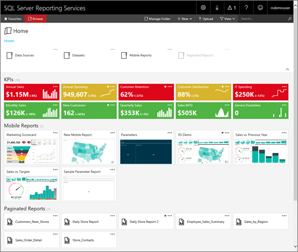
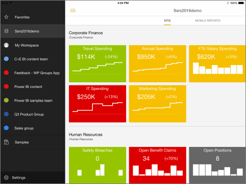
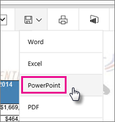
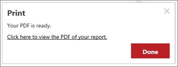
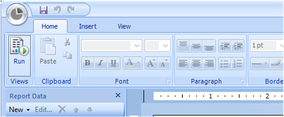

# <a name="what39s-new-in-sql-server-reporting-services-ssrs"></a>Was &#39; s neue in SQL Server Reporting Services (SSRS)
Erfahren Sie mehr über die Neuigkeiten in SQL Server [!INCLUDE[ssRSnoversion](../includes/ssrsnoversion-md.md)]. Dies umfasst die wesentlichen Features und wird aktualisiert, wenn neue Elemente veröffentlicht werden.
  
  Informationen zu in anderen Bereichen von SQL Server Neuigkeiten finden Sie unter [Neuigkeiten in SQL Server-2017](../sql-server/what-s-new-in-sql-server-2017.md) oder [Neuigkeiten in SQL Server 2016](../sql-server/what-s-new-in-sql-server-2016.md).
  
 **Herunterladen** 
 
- Laden Sie die Januar 2017 Technical Preview von Power BI-Berichten in SQL Server Reporting Services, und die Power BI Desktop-Version (SQL Server Reporting Services), aus dem **[Microsoft Download Center](https://go.microsoft.com/fwlink/?linkid=839351)**herunter.
  
-   Navigieren Sie zum Herunterladen von [!INCLUDE[ssSQL15](../includes/sssql15-md.md)]zum  **[Evaluation Center](https://www.microsoft.com/en-us/evalcenter/evaluate-sql-server-2016)**.  
  
-   Haben Sie ein Azure-Konto?  Wechseln Sie anschließend  **[hier](https://azure.microsoft.com/en-us/marketplace/partners/microsoft/sqlserver2016sp1enterprisewindowsserver2016/)**  um eine virtuelle Maschine mit bereits installierten SQL Server zu starten.  

  die aktuellen versionsanmerkungen finden Sie unter [SQL Server 2016 Release Notes](../sql-server/sql-server-2016-release-notes.md) oder [Power BI-Berichtsserver-Versionshinweise](https://powerbi.microsoft.com/documentation/reportserver-release-notes/).

Weitere Informationen zu Power BI-Berichtsserver, finden Sie unter [erste Schritte mit Power BI-Berichtsserver](https://powerbi.microsoft.com/documentation/reportserver-get-started/).

## <a name="query-designer-support-for-dax-now-in-report-builder-and-sql-server-data-tools"></a>Abfrage-Designer-Unterstützung für DAX jetzt im Berichts-Generator und SQL Server Data Tools

In den neuesten Versionen von Berichts-Generator und SQL Server Data Tools – Release Candidate (RC) können Sie nun die systemeigene DAX-Abfragen für unterstützte SQL Server Analysis Services-tabellendatenmodellen erstellen. Sie können den Abfrage-Designer beide Tools verwenden, um Drag & drop die Felder werden soll und die DAX-Abfrage, die für Sie generiert werden, statt sie selbst geschrieben haben.  
 
Erfahren Sie mehr auf die [Reporting Services-Blog](https://blogs.msdn.microsoft.com/sqlrsteamblog/2017/03/09/query-designer-support-for-dax-now-available-in-report-builder-and-sql-server-data-tools/).

* Herunterladen [SQL Server 2016 Berichts-Generator](https://go.microsoft.com/fwlink/?LinkId=734968).
* Herunterladen [SQL Server Datatools - Release Candidate](https://docs.microsoft.com/sql/ssdt/sql-server-data-tools-ssdt-release-candidate).

> **Hinweis**: Sie können den Abfrage-Designer nur für DAX verwenden, mit SSAS tabular Datenquellen integriert in SQL Server 2016 oder höher.
 
## <a name="whats-new-in-sql-server-2016"></a>Was ist neu in SQL Server 2016
  
### <a name="reporting-services-includessrswebportal-non-markdownincludesssrswebportal-non-markdown-mdmd"></a>Reporting Services [!INCLUDE[ssRSWebPortal-Non-Markdown](../includes/ssrswebportal-non-markdown-md.md)]  
 Ein neues [!INCLUDE[ssRSnoversion](../includes/ssrsnoversion-md.md)] [!INCLUDE[ssRSWebPortal-Non-Markdown](../includes/ssrswebportal-non-markdown-md.md)] ist verfügbar. Dies ist ein aktualisiertes, modernes Portal, das KPIs, mobile und paginierte Berichte sowie Excel- und Power BI Desktop-Dateien einbezieht. Das [!INCLUDE[ssRSWebPortal](../includes/ssrswebportal.md)] ersetzt den Berichts-Manager aus früheren Versionen. Ohne dass ClickOnce-Technologie erforderlich ist, können Sie auch den Publisher für mobile Berichte und Berichts-Generator aus dem [!INCLUDE[ssRSWebPortal](../includes/ssrswebportal.md)] herunterladen.
 
 Zum Erstellen mobiler Berichte ist [!INCLUDE[SS_MobileReptPub_Short](../includes/ss-mobilereptpub-short-md.md)]erforderlich.  
  
 Weitere Informationen zum [!INCLUDE[ssRSWebPortal-Non-Markdown](../includes/ssrswebportal-non-markdown-md.md)]finden Sie unter [Webportal (einheitlicher SSRS-Modus)](../reporting-services/web-portal-ssrs-native-mode.md).  
  
   
 
 #### <a name="custom-branding-for-the-includessrswebportal-non-markdownincludesssrswebportal-non-markdown-mdmd"></a>Benutzerdefiniertes Branding für [!INCLUDE[ssRSWebPortal-Non-Markdown](../includes/ssrswebportal-non-markdown-md.md)] 
  Sie können jetzt das [!INCLUDE[ssRSWebPortal-Non-Markdown](../includes/ssrswebportal-non-markdown-md.md)] mit dem Logo und den Farben Ihres Unternehmens mithilfe eines Brandingpakets anpassen.  
  
  Weitere Informationen zum benutzerdefinierten Branding finden Sie unter [Branding des Webportals](http://msdn.microsoft.com/en-us/6dac97f7-02a6-4711-81a3-e850a6b40bf1).
 
 #### <a name="key-performance-indicators-kpi-in-the-includessrswebportal-non-markdownincludesssrswebportal-non-markdown-mdmd"></a>Key Performance Indicators (KPI) im [!INCLUDE[ssRSWebPortal-Non-Markdown](../includes/ssrswebportal-non-markdown-md.md)] 

Sie können KPIs direkt im [!INCLUDE[ssRSWebPortal-Non-Markdown](../includes/ssrswebportal-non-markdown-md.md)] erstellen, die im Kontext mit dem Ordner sind, in dem Sie sich befinden. Wenn Sie KPIs erstellen, können Sie Datasetfelder wählen und diese Werte zusammenfassen. Sie können auch verwandte Inhalte auswählen, um per Drillthrough zu weiteren Details zu gelangen.
  
 
 
 Weitere Informationen finden Sie unter [Arbeiten mit KPIs im Webportal](http://msdn.microsoft.com/en-us/a28cf500-6d47-4268-a248-04837e7a09eb).
  
 
 ### <a name="mobile-reports"></a>Mobile Berichte
 
Mobile Reporting Services-Berichte sind dedizierte Berichte, die für eine Vielzahl von Formfaktoren optimiert sind und eine optimale Erfahrung für Benutzer bieten, die auf mobilen Geräten auf Berichte zugreifen. Mobile Berichte stellen eine Reihe von Visualisierungen zur Verfügung – von Zeit-, Kategorie- und Vergleichsdiagrammen über Treemap-Diagramme bis hin zu benutzerdefinierten Karten. Verbinden Sie Ihre mobilen Berichte mit einer Reihe von Datenquellen, einschließlich lokalen mehrdimensionalen und tabellarischen SQL Server Analysis Services-Daten. Gestalten Sie Ihre mobilen Berichte auf einer Entwurfsoberfläche mit anpassbaren Rasterzeilen und -spalten und flexiblen Elementen für mobile Berichte, die sich gut auf jede Bildschirmgröße skalieren lassen. Speichern Sie diese mobilen Berichte anschließend auf einem Reporting Services-Server, und verwenden Sie zum Anzeigen bzw. Interagieren mit diesen einen Browser oder die mobile Power BI-App auf iPads, iPhones, Android-Telefonen und Windows 10-Geräten.
  
#### <a name="mobile-report-publisher"></a>Publisher für mobile Berichte  
 Mit dem [!INCLUDE[SS_MobileReptPub_Long](../includes/ss-mobilereptpub-long-md.md)]können Sie mobile SQL Server-Berichte in Ihrem [!INCLUDE[ssRSnoversion](../includes/ssrsnoversion-md.md)] [!INCLUDE[ssRSWebPortal-Non-Markdown](../includes/ssrswebportal-non-markdown-md.md)]erstellen und veröffentlichen.  
  
   
  
 Weitere Informationen finden Sie unter [Erstellen und Veröffentlichen von mobilen Berichten mit dem Publisher für mobile Berichte von SQL Server](../reporting-services/mobile-reports/create-mobile-reports-with-sql-server-mobile-report-publisher.md).  
  
#### <a name="sql-server-mobile-reports-hosted-in-reporting-services-available-in-power-bi-mobile-app"></a>In Reporting Services gehostete mobile SQL Server-Berichte sind in der Power BI Mobile-App verfügbar  
 Die Power BI Mobile-App für iOS auf dem iPad und iPhone kann jetzt auf dem lokalen Berichtsserver gehostete mobile SQL Server-Berichte anzeigen.  
  
   
  
 Sie können keine Standardverbindung herstellen, ohne einige Änderungen an der Konfiguration vorzunehmen. Weitere Informationen zum Herstellen der Verbindung zwischen der Power BI Mobile-App und dem Berichtsserver finden Sie unter [Aktivieren eines Berichtsservers für einen Zugang zu Power BI von Mobilgeräten](../reporting-services/report-server/enable-a-report-server-for-power-bi-mobile-access.md).
  
### <a name="support-of-sharepoint-mode-and-sharepoint-2016"></a>Unterstützen des SharePoint-Modus und von SharePoint 2016  
 [!INCLUDE[ssSQL15](../includes/sssql15-md.md)] [!INCLUDE[ssRSnoversion](../includes/ssrsnoversion-md.md)] supports integration with SharePoint 2013 and SharePoint 2016.
 
Weitere Informationen finden Sie in den folgenden Themen:  
  
-   [Unterstützte Kombinationen von SharePoint und Reporting Services-Server und -Add-In &#40;SQL Server 2016&#41;](../reporting-services/install-windows/supported-combinations-of-sharepoint-and-reporting-services-server.md)  
  
-   [Verfügbarkeit des Reporting Services-Add-Ins für SharePoint-Produkte](../reporting-services/install-windows/where-to-find-the-reporting-services-add-in-for-sharepoint-products.md)  
  
-   [Installieren des SharePoint-Modus von Reporting Services](../reporting-services/install-windows/install-reporting-services-sharepoint-mode.md)  

### <a name="microsoft-net-framework-4-support"></a>Microsoft .NET Framework 4-Unterstützung  
 [!INCLUDE[ssRSCurrent](../includes/ssrscurrent-md.md)] unterstützt die aktuellen Versionen von Microsoft .NET Framework 4. Dies umfasst die Versionen 4.0 und 4.5.1. Wenn keine Version von .NET Framework 4.x installiert ist, installiert [!INCLUDE[ssNoVersion](../includes/ssnoversion-md.md)] Setup .NET 4.0 während der Installation von Features.  

### <a name="report-improvements"></a>Verbesserungen an Berichten

**HTML 5-Renderingmodul** : Es wurde ein neues HTML5-Renderingmodul hinzugefügt, das auf „vollständige“ moderne Webstandardsmodi und moderne Browser ausgerichtet ist.  Das neue Renderingmodul beruht nicht mehr auf dem Quirksmodus, der von einigen älteren Browsern verwendet wird.
  
 Weitere Informationen zur Browserunterstützung von finden Sie unter [Browserunterstützung für Reporting Services und Power View](../reporting-services/browser-support-for-reporting-services-and-power-view.md).  

**Moderne paginierte Berichte:** Entwerfen Sie moderne paginierte Berichte mit neuen, modernen Formatvorlagen für Diagramme, Messgeräte, Karten und andere Datenvisualisierungen.
  
**TreeMap-und Sunburst-Diagramme:** verbessern Sie Ihre Berichte mit der Strukturzuordnung  und Sunburst  Diagrammen, hervorragenden Möglichkeiten, um hierarchische Daten anzuzeigen. Weitere Informationen finden Sie unter [Strukturzuordnung und Sunburst-Diagramme in Reporting Services](../reporting-services/report-design/tree-map-and-sunburst-charts-in-reporting-services.md).  

**Berichtseinbettung:** Sie können jetzt mobile und paginierte Berichte in andere Webseiten und Anwendungen unter Verwendung eines IFRAMEs zusammen mit URL-Parametern einbetten.  

**Anheften von Berichtselementen an ein Power BI-Dashboard** : Bei der Anzeige eines Berichts im [!INCLUDE[ssRSWebPortal](../includes/ssrswebportal.md)]können Sie Berichtselemente auswählen und sie an ein [!INCLUDE[sspowerbi](../includes/sspowerbi-md.md)] -Dashboard heften.   Die Elemente, die angeheftet werden können, sind Diagramme, Messgerätbereiche, Karten und Bilder. **(1)** Wählen Sie die Gruppe aus, die das Dashboard enthält, an das Sie das Element anheften möchten, **(2)** wählen Sie das Dashboard aus, an das Sie das Element anheften möchten, und **(3)** wählen Sie aus, wie oft die Kachel im Dashboard aktualisiert werden soll.    die Aktualisierung erfolgt durch [!INCLUDE[ssRSnoversion](../includes/ssrsnoversion-md.md)] Abonnements und nach dem anheften des Elements können Sie das Abonnement bearbeiten und einen anderen Aktualisierungszeitplan konfigurieren.  
  
  
  
 Weitere Informationen finden Sie unter [Berichtsserverintegration für Power BI &#40;Configuration Manager&#41;](../reporting-services/install-windows/power-bi-report-server-integration-configuration-manager.md) und [Anheften von Reporting Services-Elementen an Power BI-Dashboards](../reporting-services/pin-reporting-services-items-to-power-bi-dashboards.md).  
 
 **PowerPoint-Rendering und -Export**: Das Microsoft PowerPoint-Format (PPTX) ist eine neue [!INCLUDE[ssRSCurrent](../includes/ssrscurrent-md.md)]-Renderingerweiterung. Sie können Berichte im PPTX-Format über die üblichen Anwendungen exportieren: Berichts-Generator, Berichts-Designer (in SSDT) und [!INCLUDE[ssRSWebPortal](../includes/ssrswebportal.md)]. Für das Beispiel zeigt die folgende Abbildung das Exportmenü des [!INCLUDE[ssRSWebPortal](../includes/ssrswebportal.md)]s. 
  
  
  
 Sie können auch das PPTX-Format für die Abonnementausgabe auswählen und den Zugriff auf die Berichtsserver-URL zum Rendern und Exportieren eines Berichts verwenden. Der folgende URL-Befehl in Ihrem Browser exportiert z. B. einen Bericht von einer benannten Instanz des Berichtsservers.  
  
```  
http://servername/ReportServer_THESQLINSTANCE/Pages/ReportViewer.aspx?%2freportfolder%2freport+name+with+spaces&rs:Format=pptx  
```  
  
 Weitere Informationen finden Sie unter [Exportieren von Berichten über URL-Zugriff](../reporting-services/export-a-report-using-url-access.md).  
 
 **PDF ersetzt ActiveX für Remotedruckvorgänge** : Die ActiveX-Druckfunktion auf der Symbolleiste des Berichts-Viewers wurde durch eine moderne, PDF-basierte Funktion ersetzt, die von verschiedenen unterstützt wird, einschließlich Microsoft Edge. Es müssen keine ActiveX-Steuerelemente heruntergeladen werden! Je nach verwendetem Browser und den Anwendungen für die Anzeige von PDF-Dateien sowie nach den installierten Diensten, öffnet [!INCLUDE[ssRSnoversion](../includes/ssrsnoversion-md.md)] entweder das Dialogfeld „Drucken“ zum Drucken des Berichts, oder Sie werden aufgefordert, eine PDF-Datei für Ihren Bericht herunterzuladen.  Als Administrator können Sie weiterhin das clientseitige Drucken über [!INCLUDE[ssManStudio](../includes/ssmanstudio-md.md)]deaktivieren. Weitere Informationen finden Sie unter [Aktivieren und Deaktivieren des clientseitigen Drucks für Reporting Services](../reporting-services/report-server/enable-and-disable-client-side-printing-for-reporting-services.md).



### <a name="subscription-improvements"></a>Abonnementverbesserungen  
 
|Funktion|Unterstützter Servermodus|  
|-------------|---------------------------|  
|**Aktivieren und Deaktivieren von Abonnements**. Neue Optionen der Benutzeroberfläche ermöglichen ein schnelles Deaktivieren und Aktivieren von Abonnements. Die deaktivierten Abonnements behalten ihre anderen Konfigurationseigenschaften, z. B. den Zeitplan, bei und können leicht aktiviert werden.<br /><br /> <br /><br /> Weitere Informationen finden Sie unter [Deaktivieren oder Anhalten der Berichts- und Abonnementverarbeitung](../reporting-services/subscriptions/disable-or-pause-report-and-subscription-processing.md).|Einheitlicher Modus|  
|**Abonnementbeschreibung**. Wenn Sie ein neues Abonnement erstellen, können Sie jetzt eine Beschreibung des Berichts als Teil der Abonnementeigenschaften einbeziehen. Die Beschreibung ist auf der Seite zur Abonnementzusammenfassung enthalten.|SharePoint- und einheitlicher Modus|  
|**Ändern des Abonnementbesitzers**. Verbesserte Benutzeroberfläche zum schnellen Ändern des Besitzers eines Abonnements. Bei früheren Versionen von [!INCLUDE[ssRSnoversion](../includes/ssrsnoversion-md.md)] konnten Administratoren die Abonnementbesitzer mithilfe eines Skripts ändern. Ab Version [!INCLUDE[ssSQL15](../includes/sssql15-md.md)] können Sie Abonnementbesitzer über die Benutzeroberfläche oder ein Skript ändern. Das Ändern des Abonnementbesitzers ist eine häufige Verwaltungsaufgabe, wenn Benutzer Ihr Unternehmen verlassen oder eine andere Funktion übernehmen.|SharePoint- und einheitlicher Modus|  
|**Freigegebene Anmeldeinformationen für Dateifreigabeabonnements**. Es gibt jetzt zwei Workflows mit [!INCLUDE[ssRSnoversion](../includes/ssrsnoversion-md.md)] -Dateifreigabeabonnements:<br /><br /> In diesem Release kann Ihr [!INCLUDE[ssRSnoversion](../includes/ssrsnoversion-md.md)] -Administrator neuerdings eine einzelne Dateifreigabe konfigurieren, die für ein oder mehrere Abonnements verwendet wird. Das Dateifreigabekonto wird im einheitlichen Modus des [!INCLUDE[ssRSnoversion](../includes/ssrsnoversion-md.md)] Configuration Managers konfiguriert. **Geben Sie ein Dateifreigabekonto an**, und auf der Abonnementkonfigurationsseite wählen Benutzer dann **Dateifreigabekonto verwenden**aus.<br /><br /> Sie können einzelne Abonnements mit spezifischen Anmeldeinformationen für die Zieldateifreigabe konfigurieren.<br /><br /> Sie können beide Ansätze auch kombinieren, sodass einige Dateifreigabeabonnements das zentrale Dateifreigabekonto verwenden, während andere Abonnements bestimmte Anmeldeinformationen nutzen.|Einheitlicher Modus|  

### <a name="sql-server-data-tools-ssdt"></a>SQL Server Data Tools (SSDT)  
 Die neue Version von SSDT enthält die Projektvorlagen für [!INCLUDE[ssRSCurrent](../includes/ssrscurrent-md.md)]: Berichtsserverprojekt-Assistent und Berichtsserverprojekt. Informationen zum Herunterladen von SSDT finden Sie unter [SQL Server Data Tools für Visual Studio 2015](http://go.microsoft.com/fwlink/?LinkId=827542).  

### <a name="report-builder-improvements"></a>Verbesserungen am Berichts-Generator

**Neue Benutzeroberfläche für den Berichts-Generator** : Die [!INCLUDE[ssRBnoversion](../includes/ssrbnoversion-md.md)] -Hauptbenutzeroberfläche weist jetzt ein modernes Layout mit optimierten UI-Elementen auf.  
  
|||  
|-|-|  
|Neu|Previous|  
|||  

**Benutzerdefinierter Parameterbereich** : Sie können jetzt den Parameterbereich anpassen. Mithilfe der Entwurfsoberfläche im Berichts-Generator, können Sie einen Parameter zu einer bestimmten Spalte und Zeile im Parameterbereich ziehen. Sie können Spalten hinzufügen und entfernen, um das Layouts des Bereichs zu ändern.   Weitere Informationen finden Sie unter [Benutzerdefiniertes Anpassen des Parameterbereichs &#40;Berichts-Generator&#41;](../reporting-services/report-design/customize-the-parameters-pane-in-a-report-report-builder.md).  
  
   

  
**Hohe DPI-Unterstützung:** [!INCLUDE[ssRBnoversion](../includes/ssrbnoversion-md.md)] hohe DPI (Punkte pro Zoll) Skalierung sowie Geräte unterstützt.  Weitere Informationen zu hohen DPI-Werten finden Sie in folgenden Themen:  
  
-   [Windows 8.1 DPI Scaling Enhancements (Erweiterungen für Windows 8.1 DPI-Skalierung)](https://blogs.windows.com/windowsexperience/2013/07/15/windows-8-1-dpi-scaling-enhancements/)  
  
-   [Hohe DPI-Werte und Windows 8.1](http://technet.microsoft.com/library/dn528848.aspx)  

## <a name="next-steps"></a>Nächste Schritte

[Neuigkeiten in Analysis Services](http://msdn.microsoft.com/en-us/aa69c299-b8f4-4969-86d8-b3292fe13f08)  
[Technical Preview of Power BI reports in SSRS - Release notes (Technical Preview von Power BI-Berichten in SSRS - Versionshinweise)](../reporting-services/reporting-services-release-notes.md)  
[Versionsanmerkungen zu SQL Server 2016](../sql-server/sql-server-2016-release-notes.md)   
[Abwärtskompatibilität](http://msdn.microsoft.com/en-us/675b0e0e-cfee-4790-9675-80fc3ea6d30f)   
[Von den SQL Server 2016-Editionen unterstützte Reporting Services-Funktionen](http://msdn.microsoft.com/en-us/39f03d2d-6e48-4b34-a9d3-07f86313b937)   
[Aktualisieren und Migrieren von Reporting Services](../reporting-services/install-windows/upgrade-and-migrate-reporting-services.md)   
[Reporting Services](../reporting-services/create-deploy-and-manage-mobile-and-paginated-reports.md)  
[Power BI-Berichtsserver](https://powerbi.microsoft.com/documentation/reportserver-get-started/)  

Weiteren Fragen wenden? [Versuchen Sie das Reporting Services-Forum stellen](http://go.microsoft.com/fwlink/?LinkId=620231)
