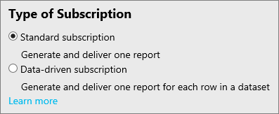

# Arbeiten mit Abonnements (Webportal)
Mithilfe der Seite „Abonnements“ können Sie alle Abonnements für den aktuellen Bericht anzeigen. Wenn Sie über ausreichende Berechtigungen verfügen (wie sie durch den Task "Alle Abonnements verwalten" übertragen werden), können Sie die Abonnements aller Benutzer anzeigen. Ansonsten sind auf dieser Seite nur Ihre Abonnements aufgeführt.  
  
Bevor Sie ein neues Abonnement erstellen können, müssen Sie sicherstellen, dass die Berichtsdatenquelle gespeicherte Anmeldeinformationen verwendet. Zum Speichern von Anmeldeinformationen verwenden Sie die Eigenschaftenseite Datenquelle.  
  
> [!NOTE] Der SQL Server-Agent-Dienst muss gestartet werden.   
  
  
   
Sie können die Seite „Abonnements“ aufrufen, indem Sie die **Auslassungspunkte (...)** eines Berichts auswählen, **Verwalten** auswählen und anschließend **Abonnements**.  
  
Sie können auf der Seite „Abonnements“ ein neues Abonnement erstellen, indem Sie **+ Neues Abonnement** auswählen. Sie können vorhandene Abonnements auch bearbeiten oder die von Ihnen ausgewählten Abonnements löschen.  
  
Diese Seite stellt auch den Ergebnisstatus des Abonnements bereit, der in der Spalte **Ergebnis** zu finden ist. Wenn für ein Abonnement ein Fehler auftritt,überprüfen Sie die Ergebnisspalte zunächst auf die Fehlermeldung.  
  
## Erstellen oder Bearbeiten eines Abonnements  
Mithilfe der Seite Neues Abonnement oder Abonnement bearbeiten können Sie ein neues Abonnement erstellen oder ein vorhandenes Abonnement für einen Bericht bearbeiten. Abhängig von Ihrer Rollenzuweisung stehen auf dieser Seite unterschiedliche Optionen zur Verfügung. Benutzer mit erweiterten Berechtigungen können zusätzliche Optionen verwenden.  
  
Abonnements werden nur für Berichte unterstützt, die unbeaufsichtigt ausgeführt werden können. Der Bericht muss zumindest gespeicherte oder gar keine Anmeldeinformationen verwenden. Wenn der Bericht Parameter verwendet, muss ein Standardwert angegeben werden. Abonnements können inaktiv werden, wenn die Berichtsausführungseinstellungen geändert oder die von den Parametereigenschaften verwendeten Standardwerte entfernt werden. Weitere Informationen finden Sie unter [Erstellen und Verwalten von Abonnements für Berichtsserver im einheitlichen Modus].  
  
### Typ des Abonnements  
Können Sie zwischen einem **Standardabonnement** und einem **datengesteuerten Abonnement** wählen.  
  
  
   
Ein datengesteuertes Abonnement fragt bei jeder Ausführung eine Abonnentendatenbank nach Abonnementinformationen ab. Datengesteuerte Abonnements verwenden die Abfrageergebnisse, um die Empfänger des Abonnements, Übermittlungseinstellungen und Berichtsparameterwerte zu bestimmen. Zur Laufzeit führt der Berichtsserver eine Abfrage aus, um die für das Abonnement verwendeten Einstellungen abzurufen.   
  
Wenn Sie ein datengesteuertes Abonnement erstellen möchten, müssen Sie mit dem Schreiben einer Abfrage oder eines Befehls zum Abrufen der Daten für das Abonnement vertraut sein. Sie müssen auch über einen Datenspeicher verfügen, der die Abonnentendaten (beispielsweise die Namen der Abonnenten und ihre E-Mail-Adressen) enthält, die für das Abonnement verwendet werden.  
  
Diese Option steht nur für Benutzer mit erweiterten Berechtigungen zur Verfügung. Wenn die Standardsicherheit verwendet wird, können keine datengesteuerten Abonnements für Berichte im Ordner Meine Berichte verwendet werden.  
  
### Ziel  
Wählen Sie die Übermittlungserweiterung aus, die zum Verteilen des Berichts verwendet werden soll.   
  
Die Verfügbarkeit einer Übermittlungserweiterung hängt davon ab, ob sie auf dem Berichtsserver installiert und konfiguriert ist. Berichtsserver-E-Mail stellt die Standardübermittlungserweiterung dar. Sie muss jedoch konfiguriert werden, bevor Sie sie verwenden können. Die Dateifreigabeübermittlung erfordert keine Konfiguration. Sie müssen jedoch einen freigegebenen Ordner definieren, bevor Sie sie verwenden können.  
  
  
  
Abhängig von der ausgewählten Übermittlungserweiterung werden die folgenden Einstellungen angezeigt:  
  
-   E-Mail-Abonnements stellen Felder bereit, die den Benutzern von E-Mail vertraut sind (z.B. die Felder „An“, „Betreff“ und „Priorität“). Geben Sie **Bericht einschließen** an, um den Bericht einzubetten oder anzufügen, oder wählen Sie **Link einschließen** aus, um einem Bericht eine URL hinzuzufügen. Mithilfe von **Renderformat** können Sie ein Präsentationsformat für den angefügten oder eingebetteten Bericht auswählen.  
  
-   Dateifreigabeabonnements stellen Felder bereit, die es Ihnen ermöglichen, einen Zielspeicherort anzugeben. Jeder beliebige Bericht kann an eine Dateifreigabe übermittelt werden. Berichte, die interaktive Funktionen unterstützen (einschließlich Matrixberichte, in denen ein Drilldown zu unterstützenden Zeilen und Spalten möglich ist), werden jedoch als statische Dateien dargestellt. Drilldownzeilen und -spalten können in einer statischen Datei nicht angezeigt werden. Der Dateifreigabename muss im UNC-Format (Uniform Naming Convention) angegeben werden (Beispiel: \mycomputer\public\myreportfiles). Der Pfadname darf keinen abschließenden umgekehrten Schrägstrich enthalten. Die Berichtsdatei wird in einem Dateiformat ausgegeben, das auf dem Renderformat basiert. Wenn Sie beispielsweise Excel auswählen, wird der Bericht als .xlsx-Datei ausgegeben.  
  
### Dataset eines datengesteuerten Abonnements  
Für ein datengesteuertes Abonnement müssen Sie das für das Abonnement verwendete Dataset definieren. Wählen Sie **Dataset bearbeiten** aus, um diese Informationen bereitstellen.  
  
  
  
Sie müssen zuerst eine **Datenquelle** für die Abfrage bereitstellen. Dies kann entweder eine freigegebene Datenquelle sein, Sie können aber alternativ auch eine benutzerdefinierte Datenquelle angeben.  
  
Sie müssen anschließend eine **Abfrage** bereitstellen, die die verschiedenen Optionen auflistet, die für die Ausführung des Abonnements benötigt werden. Der Bildschirm stellt die Felder bereit, die zurückgegeben werden müssen. Diese Felder variiert je nach Verfahren für die Bereitstellung und die Parameter des Berichts.  
  
Die besten Ergebnisse erzielen Sie, wenn Sie die Abfrage zunächst in SQL Server Management Studio ausführen, bevor Sie sie in dem datengesteuerten Abonnement verwenden. Sie können dann die Ergebnisse untersuchen, um sicherzustellen, dass Sie die Informationen erhalten, die Sie benötigen. Auf folgende wichtige Punkte sollten Sie bei den Abfrageergebnissen achten:  
  
-   Die Spalten im Resultset bestimmen die Werte, die Sie für Übermittlungsoptionen und Berichtsparameter angeben können. Wenn Sie zum Beispiel ein datengesteuertes Abonnement für die E-Mail-Übermittlung erstellen, sollte der Resultset eine Spalte mit E-Mail-Adressen enthalten.  
  
-   Die Zeilen im Resultset bestimmen die Anzahl von Berichtsübermittlungen, die generiert werden. Wenn der Resultset 10.000 Zeilen enthält, generiert der Berichtsserver 10.000 Benachrichtigungen und Übermittlungen.  
  
  
  
Sie können anschließend die Abfrage überprüfen. Sie können auch ein **Abfragetimeout** definieren.  
  
Nachdem die Abfrage erstellt wurde, können Sie dann die Werte den benötigten Feldern zuweisen. Sie können die Daten manuell eingeben oder ein Feld aus dem Dataset auswählen, das Sie erstellt haben.  
  
  
  
