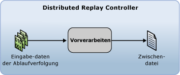

# Vorbereiten der Eingabedaten für die Ablaufverfolgung
  Bevor Sie mit der [!INCLUDE[msCoName](../../includes/msconame-md.md)] [!INCLUDE[ssNoVersion](../../includes/ssnoversion-md.md)] Distributed Replay-Funktion eine verteilte Wiedergabe beginnen können, müssen Sie die Eingabedaten der Ablaufverfolgung vorbereiten, indem Sie im Distributed Replay-Verwaltungstool die Vorbereitungsphase initiieren. In der Vorverarbeitungsphase verarbeitet der Distributed Replay Controller die Ablaufverfolgungsdaten und generiert eine Zwischendatei:  
  
   
  
 Weitere Informationen zur Vorverarbeitungsphase finden Sie unter [SQL Server Distributed Replay](../../tools/distributed-replay/sql-server-distributed-replay.md).  
  
> [!NOTE]  
>  Die Eingabedaten der Ablaufverfolgung müssen in einer Version von [!INCLUDE[ssNoVersion](../../includes/ssnoversion-md.md)] aufgezeichnet werden, die mit Distributed Replay kompatibel ist. Die Eingabedaten der Ablaufverfolgung müssen zudem mit dem Zielserver kompatibel sein, für den Sie die Ablaufverfolgungsdaten wiedergeben möchten. Weitere Informationen zu den Versionsanforderungen finden Sie unter [Distributed Replay: Anforderungen](../../tools/distributed-replay/distributed-replay-requirements.md).  
  
### So bereiten Sie die Eingabedaten der Ablaufverfolgung vor  
  
1.  **(Optional) Ändern der Konfigurationseinstellungen für die Vorverarbeitung**: Wenn Sie die Konfigurationseinstellungen für die Vorverarbeitung ändern möchten, um z.B. Systemsitzungen zu filtern oder die maximale Leerlaufzeit zu konfigurieren, müssen Sie das `<PreprocessModifiers>` -Element der XML-Konfigurationsdatei für die Vorverarbeitung ändern: `DReplay.exe.preprocess.config`. Wenn Sie die Vorverarbeitungskonfigurationsdatei ändern möchten, empfiehlt es sich, statt des Originals eine Kopie zu ändern. Zum Ändern der Einstellungen führen Sie folgende Schritte aus:  
  
    1.  Erstellen Sie eine Kopie der Standardkonfigurationsdatei für die Vorverarbeitung `DReplay.exe.preprocess.config`, und benennen Sie die neue Datei um. Die Standardkonfigurationsdatei für die Vorverarbeitung befindet sich im Installationsordner des Verwaltungstools.  
  
    2.  Ändern Sie in der neuen Konfigurationsdatei die Vorverarbeitungskonfigurationseinstellungen.  
  
    3.  Wenn Sie die Vorverarbeitungsphase initiieren (nächster Schritt), geben Sie mit dem *config_file* -Parameter der **preprocess** -Option den Speicherort der geänderten Konfigurationsdatei an.  
  
     Weitere Informationen zur Konfigurationsdatei für die Vorverarbeitung finden Sie unter [Konfigurieren von Distributed Replay](../../tools/distributed-replay/configure-distributed-replay.md).  
  
2.  **Initiieren der Vorverarbeitungsphase**: Um die Eingabedaten der Ablaufverfolgung vorzubereiten, müssen Sie das Verwaltungstool mit der **preprocess**-Option ausführen. Weitere Informationen finden Sie unter [Vorverarbeitungsoption &#40;Verwaltungstool „Distributed Replay“&#41;](../../tools/distributed-replay/preprocess-option-distributed-replay-administration-tool.md).  
  
    1.  Öffnen Sie die Windows-Eingabeaufforderung (**CMD.exe**), und navigieren Sie zum Installationspfad des Verwaltungstools „Distributed Replay“ (**DReplay.exe**).  
  
    2.  (Optional) Wenn der Controllerdienst und das Verwaltungstool auf unterschiedlichen Computern ausgeführt werden, geben Sie über den *controller* -Parameter **-m**den entsprechenden Controller an.  
  
    3.  Verwenden Sie den *input_trace_file* -Parameter **-i**, um den Speicherort und die Namen der Eingabedateien der Ablaufverfolgung anzugeben.  
  
    4.  Geben Sie über den *controller_working_directory* -Parameter **-d**den Speicherort auf dem Controller an, an dem die Zwischendatei gespeichert werden soll.  
  
    5.  (Optional) Geben Sie mit dem *config_file* -Parameter **-c**den Speicherort der Konfigurationsdatei für die Vorverarbeitung an. Wenn Sie eine Kopie der Standardkonfigurationsdatei für die Vorverarbeitung geändert haben, verwenden Sie diesen Parameter, um auf die neue Konfigurationsdatei zu zeigen.  
  
    6.  (Optional) Geben Sie mit dem *status_interval* -Parameter **-f**an, ob Statusmeldungen im Verwaltungstool mit einer anderen Frequenz als 30 Sekunden angezeigt werden sollen.  
  
     Um z.B. die Vorverarbeitungsphase auf dem Computer mit dem Controllerdienst zu initiieren, wenn eine Ablaufverfolgungsdatei im Pfad `c:\trace1.trc`und ein Controllerarbeitsverzeichnis im Pfad `c:\WorkingDir` vorhanden sind und eine Statusmeldung mit dem Standardintervall von 30 Sekunden angezeigt werden soll, ist folgende Syntax erforderlich: `dreplay preprocess -i c:\trace1.trc -d c:\WorkingDir`  
  
3.  Nach Abschluss der Vorverarbeitungsphase wird die Zwischendatei im Controllerarbeitsverzeichnis gespeichert. Zum Initiieren der Ereigniswiedergabephase müssen Sie das Verwaltungstool mit der **replay** -Option ausführen. Weitere Informationen finden Sie unter [Wiedergeben von Ablaufverfolgungsdaten](../../tools/distributed-replay/replay-trace-data.md).  
  
## Siehe auch  
 [SQL Server Distributed Replay](../../tools/distributed-replay/sql-server-distributed-replay.md)   
 [Distributed Replay: Anforderungen](../../tools/distributed-replay/distributed-replay-requirements.md)   
 [Befehlszeilenoptionen des Verwaltung &#40; Distributed Replay Utility &#41;](../../tools/distributed-replay/administration-tool-command-line-options-distributed-replay-utility.md)   
 [Konfigurieren von Distributed Replay](../../tools/distributed-replay/configure-distributed-replay.md)  
  
  
